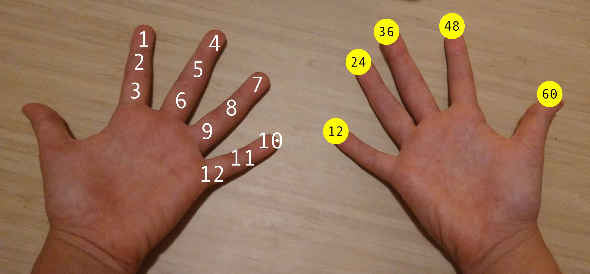
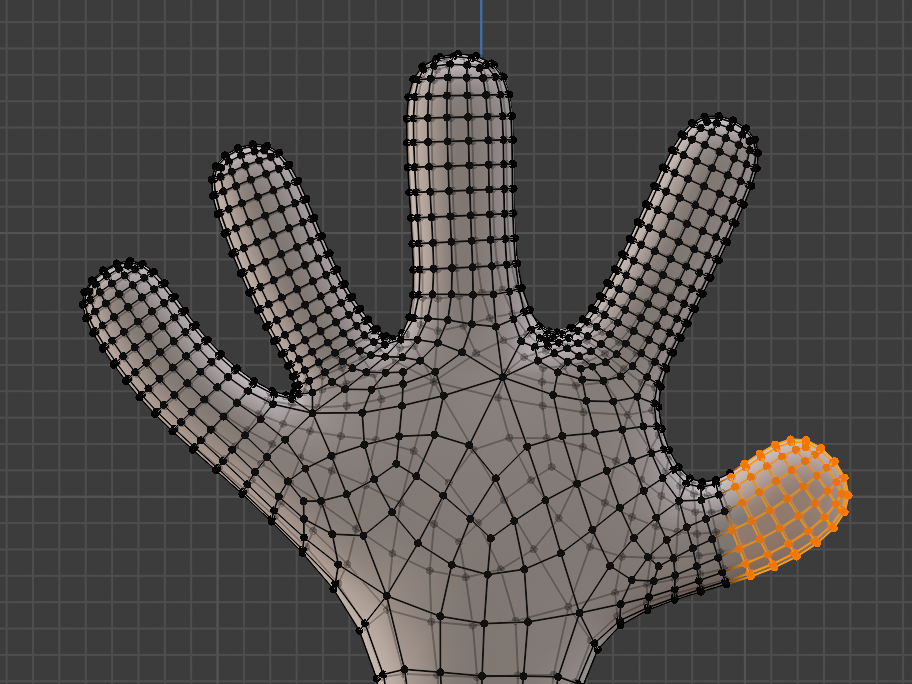
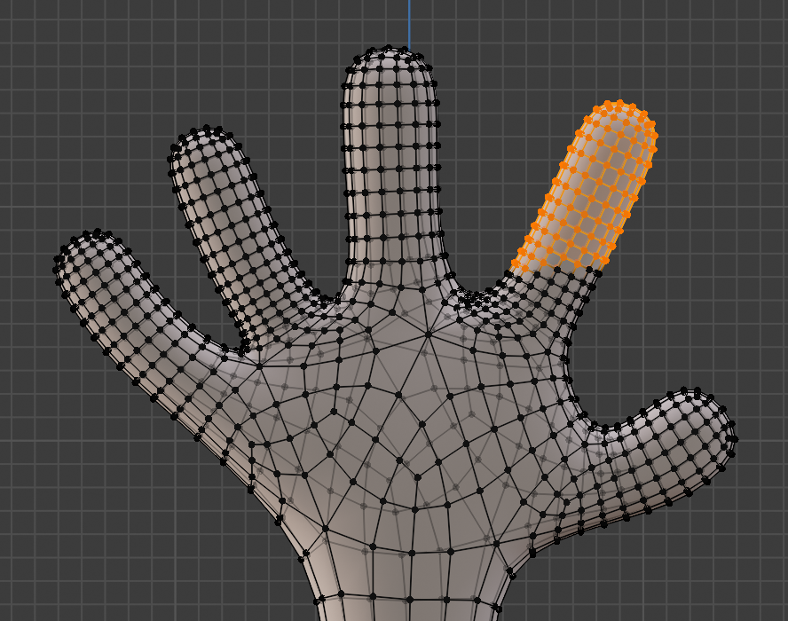
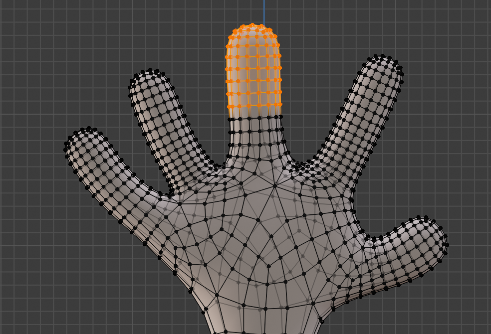
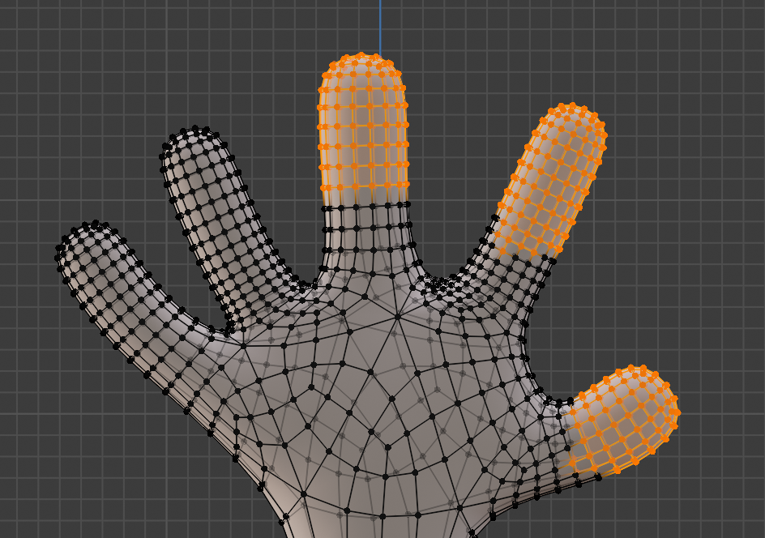
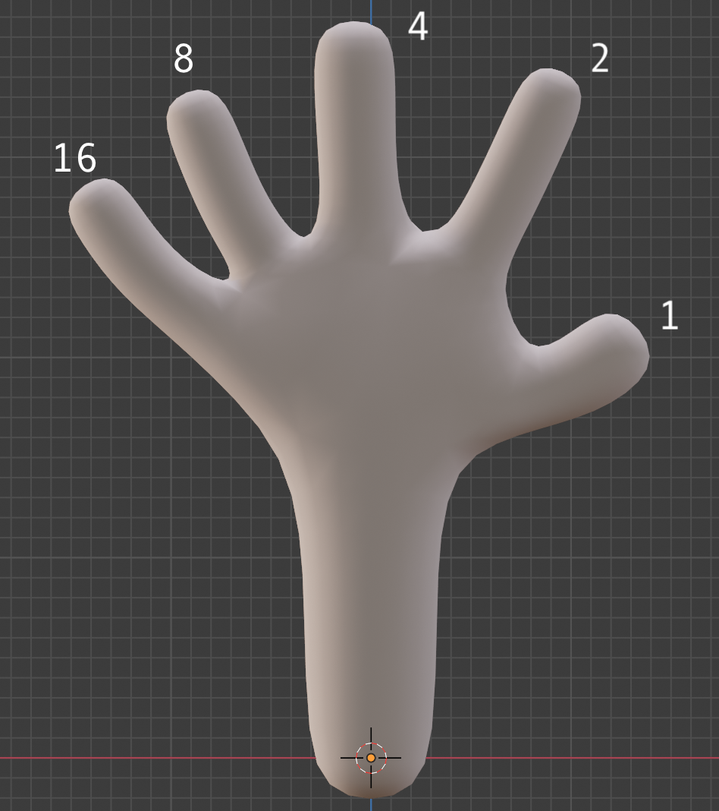

# Numerazione binaria

> Per questa sezione, confrontate anche il vostro libro di testo al capitolo _"A2 I sistemi di numerazione"_

Cominciamo il nostro viaggio dall'elemento più basilare del nostro sistema di elaborazione: il bit e la numerazione binaria.

Intanto domandiamoci: perché la numerazione binaria? Perché per come sono fatti i computer, è la loro base di numerazione più adatta. Ma dovremmo anche chiederci: perché noi usiamo la numerazione decimale?

In effetti, non c'è niente di speciale nella base 10. La maggior parte delle antiche popolazioni ha usato questa base di numerazione semplicemente perché abbiamo 10 dita. Non a caso ancora adesso in informatica usiamo la parola "digit" (che deriva dalla parola latina _digitus_, dito) per indicare un numero.

Ma ci sono delle eccezioni: alcune culture antiche ad esempio contavano in base 5 (usando quindi una sola mano), o la tribù Faiwol della Nuova Guinea contava in base 27, usando anche altre parti del corpo oltre le dita, come naso ed orecchie. Ma il caso più importante è sicuramente quello dei babilonesi, che contavano in base 12. Questa base era particolarmente utile perché facilmente divisibile per 2, 3, 4 e 6. Probabilmente non è un caso che siano stati proprio i babilonesi a mettere le basi della trigonometria e dello studio della sfera celeste.

<figure class="center w80p">
  
  <figcaption>Numerazione in base 12 usata nell'antica Babilonia</figcaption>
</figure>

# Basi di numerazione e simboli
Indipendentemente dalla base utilizzata, le regole per formare i numeri è sempre la stessa.

Per prima cosa, abbiamo bisogno di un numero di _simboli_ pari alla base di numerazione. Ad esempio, per la base 10, abbiamo i seguenti simboli: 0,1,2,3,4,5,6,7,8,9.

Sono le cifre a cui siamo abituati, ma adesso dobbiamo guardarle con uno sguardo nuovo: come dei simboli, appunto, che rappresentano una cifra del nostro sistema di numerazione.

> Possiamo rappresentare le cifre anche con simboli diversi, come ad esempio in Cina: 一,二,三,四,五,六,七,八,九,十. Non cambia nulla, i simboli sono una convenzione tra chi scrive e chi legge, basta mettersi d'accordo.

Con la numerazione binaria, abbiamo bisogno di soli due simboli. Possiamo scegliere i simboli che preferiamo, ed effettivamente in informatica ne incontrerete diversi, ad esempio:
- 0,1
- +,-
- acceso (on), spento (off)
- pieno, vuoto
- alzato ed abbassato

L'importante è mettersi d'accordo. Noi in questa trattazione useremo prevalentemente 0 ed 1.

# Contare sulla punta delle dita
Per esercitarci un po' con i numeri binari, possiamo provare ad esercitarci a contare con una mano sola.

Permettetemi di usare questo modello per rappresentare una mano (scusate se non è venuto molto bene).

<div class="sketchfab-embed-wrapper center w100"> <iframe title="Hand" frameborder="0" allowfullscreen mozallowfullscreen="true" webkitallowfullscreen="true" allow="autoplay; fullscreen; xr-spatial-tracking" xr-spatial-tracking execution-while-out-of-viewport execution-while-not-rendered web-share src="https://sketchfab.com/models/224e8b7d42864826af07b281f1fcd446/embed"> </iframe> <p style="font-size: 13px; font-weight: normal; margin: 5px; color: #4A4A4A;"> <a href="https://sketchfab.com/3d-models/hand-224e8b7d42864826af07b281f1fcd446?utm_medium=embed&utm_campaign=share-popup&utm_content=224e8b7d42864826af07b281f1fcd446" target="_blank" style="font-weight: bold; color: #1CAAD9;"> Hand </a> by <a href="https://sketchfab.com/claudio.capobianco?utm_medium=embed&utm_campaign=share-popup&utm_content=224e8b7d42864826af07b281f1fcd446" target="_blank" style="font-weight: bold; color: #1CAAD9;"> claudio.capobianco </a> on <a href="https://sketchfab.com?utm_medium=embed&utm_campaign=share-popup&utm_content=224e8b7d42864826af07b281f1fcd446" target="_blank" style="font-weight: bold; color: #1CAAD9;">Sketchfab</a></p></div>

Se tengo tutte le dita abbassate, ho il numero 0.

Di seguito alcuni esempi come abbiamo visto in classe.

<figure class="center w80p">
  
  <figcaption>Mano destra, numero 1</figcaption>
</figure>

<figure class="center w80p">
  
  <figcaption>Mano destra, numero 2</figcaption>
</figure>

<figure class="center w80p">
  
  <figcaption>Mano destra, numero 3</figcaption>
</figure>

<figure class="center w80p">
  
  <figcaption>Mano destra, numero 4</figcaption>
</figure>

<figure class="center w80p">
  
  <figcaption>Mano destra, numero 7</figcaption>
</figure>

In pratica ogni dito ha un valore, che deve essere sommato agli altri se alzato ("acceso"). Di seguito il valore di ogni dito della mano.

<figure class="center w80p">
  
  <figcaption>Valore delle dita</figcaption>
</figure>

# Valore massimo e numero di valori rappresentabili
Qual'è il valore massimo che posso rappresentare?

Se alzo tutte le dita, ottengo il valore:

```
valore massimo: 1+2+4+8+16 = 31
```

Quindi, con una sola mano posso contare fino a 31.

Il metodo è facilmente estendibile anche per calcolare con due mani.

La regola è che ogni dito ha un valore di:

```
valore dito n = 2^n
```

che si legge 2 elevato alla n.

Bisogna considerare che, in informatica, si comincia a contare sempre dal numero 0, quindi il primo dito ha n=0, il secondo dito n=1, e così via.

Quindi vediamo il valore per tutte e dieci le dita:
- primo dito (pollice mano destra): `2^0=1`
- secondo dito (indice mano destra): `2^1=2`
- terzo dito (medio mano destra): `2^2=4`
- quarto dito (anulare mano destra): `2^3=8`
- quindo dito (mignolo mano destra): `2^4=16`
- sesto dito (pollice mano sinistra): `2^5=32`
- settimo dito (indice mano sinistra): `2^6=64`
- ottavo dito (medio mano sinistra): `2^7=128`
- nono dito (anulare mano sinistra): `2^8=256`
- decimo dito (mignolo mano sinistra): `2^512`

Domanda: qual è il numero massimo che possiamo ottenere con due mani?

Lascio a voi il calcolo, ma potrete facilmente vedere che vale la formula generale:

`numero massimo = 2^n - 1`


dove n è il numero delle dita.

# Dalle dita al bit
Adesso siamo pronti per generalizzare i concetti che abbiamo visto fino ad adesso.

Al posto delle dita, come abbiamo detto, possiamo usare qualsiasi cosa. Ogni singolo elemento che può avere due stati (0,1 oppure acceso,spento) prende il nome di _bit_.

Con una mano, abbiamo a disposizione quindi 5 bit. Con due mani, abbiamo a disposizione 10 bit.

Il numero di bit è la cosa più importante che ci serve sapere quando trattiamo di dati in informatica: come abbiamo visto determina infatti il numero massimo che possiamo rappresentare.

Facciamo alcuni esempi: se voglio contare i compagni della vostra classe, considerando che siete 25, mi serviranno almeno 5 bit, perché 2^4-1=15 non basta, mentre 2^5-1 = 31 e va bene. Se devo contare il numero di studenti della scuola, che sono circa 1200, mi serviranno almeno 11 bit, in quanto 2^10-1 = 1023 e 2^11-1 = 2047.

Domanda: quanti bit servono per contare gli abitanti dell'Italia, che sono circa 60 milioni? e quelli della terra, circa 8 miliardi?

Proviamo ad andare un po' più in là: immaginiamo di avere uno schermo largo 4 pixel e alto 3 pixel (uno schermo minuscolo, ma va bene per questo esempio). Ogni pixel può avere 16 colori. Se uso anche lo 0 per rappresentare i colori, non devo togliere 1 al valore massimo, quindi serviranno esattamente 4 bit per ogni pixel. Quanti bit mi servono in totale per memorizzare tutti i pixel dello schermo?

| x | x | x | x |
|---|---|---|---|
| x | x | x | x |
| x | x | x | x |


Il conto è il seguente:
```
numero di pixel totali: 4*3 = 12
numero di bit per pixel: 4
numero totale di bit: 4*12 = 48 
```

